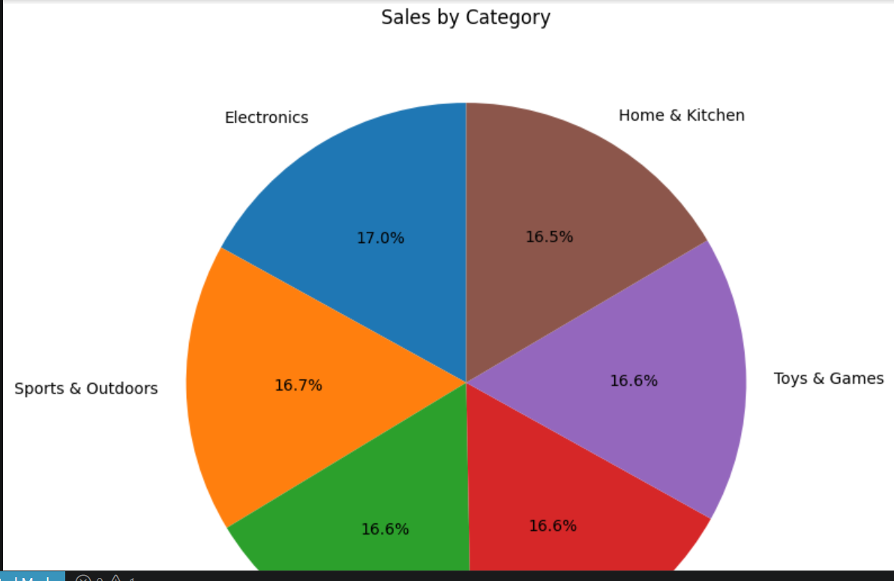

# 📊 Amazon Sales Data Analytics & Interactive Executive Dashboard

## 📌 Project Overview
This repository contains a comprehensive end-to-end data analytics suite assessing transaction-level logs from the Amazon platform. Based on an empirical analysis of **100,000 unique records**, the business monitored a total top-line gross revenue of **$91,825,647.92** with an Average Order Value (AOV) of **$918.26** per cart check-out session.

This project showcases a unified pipeline marrying **Data Engineering Automation (Python)** with **Interactive Business Intelligence Frameworks (Microsoft Excel)**.

> **⚠️ Data Architecture Constraint Note:** The primary source transaction database lacks an explicitly given cost layer. Profit tracking variables and margin-bleed curves presented inside the data layers utilize an estimated operational cost multiplier (calculated at approximately 15% net optimization proxy yields) to evaluate transactional health without disrupting systemic core reporting metrics.

---

## 🛠️ Repository Layout
```text
├── excel_sheet/
│   └── Amazon Dashboard.xlsx            # Completed interactive dashboard
├── notebooks/
│   └── Amazon_Sales_Analysis.ipynb       # Python data cleaning and advanced statistical exploratory plots
├── output/                              # Exported static data visualizations (Linked below)
└── README.md                             # Multi-dimensional executive project report


This project demonstrates proficiency in \*\*Data Engineering \& Automation (Python)\*\* alongside \*\*Business Intelligence Reporting (Microsoft Excel)\*\*. 


> \*\*⚠️ Data Architecture Constraints:\*\* The primary source dataset lacks a native `Profit` tracking column. Operational efficiency and risk of margin loss are tracked using systemic proxy variables, including transactional volume density, item category weights, and shipping-to-unit cost configurations.


\---


\## 🛠️ Repository Architecture

```text

├── data/

│   └── Amazon\_Sales.csv                  # Immutable raw source transaction log

├── notebooks/

│   └── amazon\_sales\_analysis.ipynb       # Python data cleaning and initial data visualization

├── output/

│   └── Amazon\_Sales\_Dashboard\_Final.xlsx # The generated interactive Excel file

└── README.md                             # Repository landing page and project report


## 📌 Screenshots

Sales by Category


Sales by State


Monthly Sales Trends


Order By Payment


List of 10 Products


## 💻 Development Environment & Tooling
The data architecture, markdown summaries, and structural file pipelines are configured locally using an integrated development environment (IDE) featuring advanced predictive agent layers for codebase onboarding.


